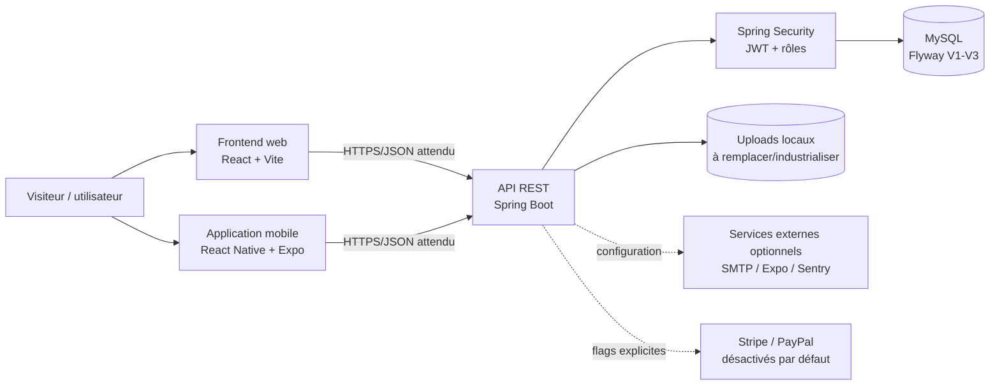
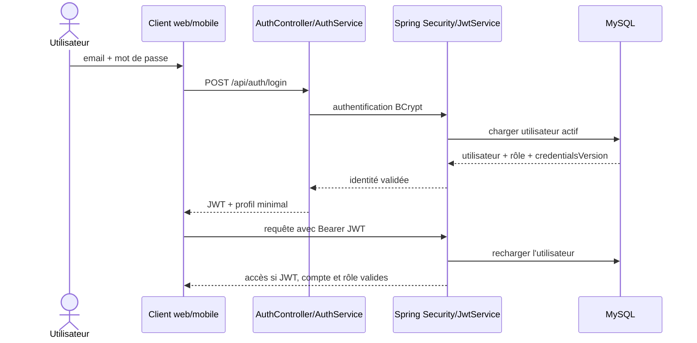
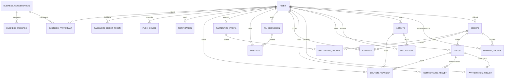

# Bx-Connect — Dossier de transmission à Office Agent

> **Objet du document.** Ce dossier constitue une source technique et documentaire pour la rédaction du rapport final de TFE. Il décrit l'état vérifiable de la branche `main` au commit `c735b913d45fd8af6fd3976e68de6365e5fe7d78` (`feat: make payment providers optional`) observé le 18 août 2026. Il ne remplace ni les consignes officielles de l'établissement, ni une recette utilisateur, ni un avis juridique ou un audit de sécurité indépendant.
>
> **Règle de lecture.** Les termes employés sont : **vérifié** (preuve d'exécution ou état directement contrôlé), **implémenté** (code présent), **partiel** (présent mais incomplet ou non validé de bout en bout), **documenté** (procédure écrite mais non nécessairement exécutée), **prévu/masqué** (code ou route hors périmètre visible), **absent**, et **à confirmer par Mardoche**.

## Résumé exécutif destiné à Office Agent

Bx-Connect est présenté par Mardoche Malaba comme son projet individuel de travail de fin d'études. L'application est développée dans le contexte de l'association Bx-Jeunes Impact, mais elle doit être distinguée du site vitrine public de l'association et d'une autre application confiée à des stagiaires. Le dépôt ne contient pas de preuve institutionnelle suffisante pour établir l'établissement, la formation, le promoteur, l'année académique officielle ou la formulation imposée du sujet : ces éléments doivent être fournis par l'auteur.

Le produit est une plateforme de gestion associative organisée autour de cinq rôles authentifiés : `MEMBRE`, `REFERENT`, `PARTENAIRE`, `ADMIN` et `SUPER_ADMIN`. Le code contient aussi le rôle `VISITEUR`, mais celui-ci n'est pas utilisé comme compte authentifié dans l'inscription publique. L'inscription force le rôle `MEMBRE`. Le périmètre fonctionnel visible comprend l'authentification, le profil, les groupes, les activités et inscriptions, les présences, les projets et leur validation, les annonces/opportunités, les notifications, la messagerie, les conversations métier, l'espace partenaire et plusieurs fonctions d'administration. Certaines fonctions présentes dans le code sont explicitement masquées du MVP web : prestations bénévoles, paiements, impact, rapports référent et certaines affectations partenaires.

L'architecture comporte trois clients/couches principales : un backend Java 21/Spring Boot 3.4.5, un frontend React 19/Vite 8 et une application React Native 0.83.6 avec Expo 55. Le backend expose une API REST, sécurisée par Spring Security et des JWT. Les mots de passe sont encodés avec BCrypt, coût 12. La persistance utilise JPA/Hibernate et MySQL ; Flyway est la source de vérité du schéma avec trois migrations : V1 (schéma initial), V2 (index principaux) et V3 (jetons de réinitialisation de mot de passe). Swagger/OpenAPI est activé en développement et désactivé en production.

La validation backend la plus récente est solide mais ne doit pas être extrapolée à toute l'application. Les 44 rapports Surefire locaux, datés au plus tard du 16 août 2026 à 10:42:57 +0200, comptabilisent **340 tests, 340 réussites, 0 échec, 0 erreur et 0 test ignoré**. Ils proviennent d'un `clean verify` exécuté avec Java 21, Docker et un dépôt Maven temporaire. Le smoke test Testcontainers a démarré MySQL 8.0.46 ARM64, appliqué Flyway V1 à V3, atteint le schéma v3 et initialisé JPA. Le JAR Spring Boot local existe et mesure 80 837 058 octets. Ces artefacts prouvent l'état du commit courant au moment du test, mais pas un fonctionnement sur une infrastructure de production.

La qualité frontend et mobile est moins démontrée. Le frontend ne déclare qu'un test Node ciblé sur la politique de mot de passe ; aucun framework E2E n'est configuré dans `package.json`. Un dossier `dist/` local existe, mais son horodatage (5 août 2026) précède le commit documenté : il ne constitue pas une preuve de build du commit courant. Le mobile dispose d'une commande lint, mais d'aucune commande de test. Aucun résultat local actuel ne prouve un build iOS, Android ou EAS distribuable.

La sécurité a reçu plusieurs renforcements vérifiables : contrôle des rôles et de l'appartenance métier, garde de configuration de production, CORS explicite, validation des entrées, limitation de débit ciblée, contrôle binaire des images uploadées, jetons de réinitialisation à usage unique stockés sous forme de hash, version de credentials intégrée au JWT, Request ID et nettoyage des événements Sentry. Les paiements Stripe et PayPal sont désactivés par défaut ; lorsque désactivés, leurs configurations, services, contrôleurs et endpoints ne sont pas chargés. Ils ne font pas partie du MVP initial.

Des limites importantes subsistent. Le token web est conservé dans `localStorage`, ce qui augmente l'impact potentiel d'une faille XSS. CSRF est désactivé dans une architecture stateless avec bearer token ; cette décision doit être réévaluée si l'authentification passe à des cookies. Le rate limiting est en mémoire, par instance, et fait confiance au premier `X-Forwarded-For` sans preuve de configuration d'un proxy de confiance. Les uploads sont stockés sur le système de fichiers local et servis publiquement ; aucun stockage objet persistant, antivirus, politique de rétention ou sauvegarde de fichiers n'est opérationnellement démontré.

Un incident Git historique a aussi été identifié : des uploads contenant potentiellement des données personnelles et financières et des captures techniques ont été suivis puis poussés. Les fichiers ont été retirés de l'arbre courant et `backend/uploads` est ignoré, mais les anciens blobs et plusieurs tags les conservent en attente d'une purge coordonnée. Aucune donnée sensible n'est reproduite dans ce document.

La documentation de production est détaillée : déploiement, variables d'environnement, sauvegarde/restauration, monitoring et réponse aux incidents. Elle reste toutefois principalement procédurale. Aucun hébergeur, domaine, SMTP, MySQL managé, stockage de secrets, pipeline CI/CD ou monitoring réel n'est prouvé comme actif. Les scripts de sauvegarde/restauration existent, mais aucun exercice récent de restauration n'est attesté par un artefact durable.

Sur le plan RGPD, le produit enregistre l'acceptation des conditions et de la politique de confidentialité, leur horodatage et une version juridique. Les pages légales sont disponibles en FR/NL/EN. Cela ne constitue pas une conformité opérationnelle complète : registre des traitements, contrats de sous-traitance, gestion des mineurs, durées de conservation, export/portabilité, procédure d'exercice des droits, suppression/anonymisation cohérente et gestion formelle de l'incident historique restent à confirmer ou à construire.

En conclusion, Bx-Connect est démontrable et le backend est techniquement bien vérifié. Une préproduction avec données fictives paraît atteignable après figement du périmètre web, mise en place de l'infrastructure, du stockage des uploads, de SMTP et de tests E2E. Une bêta avec de vraies personnes demeure bloquée par la sécurité navigateur et horizontale à compléter, l'incident Git historique, le RGPD opérationnel, la restauration, le monitoring et le support. Le mobile et les paiements peuvent rester dans des phases distinctes.

---

## 1. Fiche d'identité du projet

| Élément | État documentaire |
|---|---|
| Nom | **Bx-Connect** ou **BX-CONNECT** selon les écrans et documents. Le nom d'artefact backend est `bx-connect`. |
| Auteur | **Mardoche Malaba**, nom présent dans `SwaggerConfig.java` et confirmé dans la demande de transmission. L'orthographe officielle à utiliser sur la couverture est à confirmer. |
| Nature | Projet individuel de TFE, selon la déclaration de Mardoche. Le dépôt ne contient pas le règlement académique permettant de le certifier. |
| Contexte académique | TFE ; établissement, formation, année académique, promoteur et jury à confirmer. Le `pom.xml` contient encore la description « TFE 2025 », tandis que Swagger affiche « TFE 2025/2026 » : contradiction à résoudre. |
| Contexte associatif | Développement dans le contexte de Bx-Jeunes Impact. La forme exacte de la collaboration, le commanditaire et les droits de propriété doivent être confirmés. |
| Public visé | Membres, référents, partenaires, administrateurs et super-administrateurs d'une structure associative ; visiteurs pour certaines consultations publiques. |
| Problème traité | Centraliser la gestion des utilisateurs, groupes, activités, inscriptions, projets, annonces, partenaires, communications, notifications et opérations administratives. Cette formulation est déduite du code, pas d'un cahier des charges officiel retrouvé. |
| Objectifs généraux | Fournir des parcours adaptés aux rôles, sécuriser les accès, structurer les workflows, conserver un historique métier et proposer des interfaces web et mobile multilingues. |
| MVP web réel | Authentification, mot de passe oublié, profil, activités, groupes, projets, annonces, notifications, messagerie, conversations métier, espaces par rôle et administration. Paiements, prestations, impact, rapports et certaines affectations sont masqués dans `frontend-web/src/App.jsx`. |

**Sources internes :** `backend/pom.xml`, `backend/src/main/java/com/bxjeunes/bx_connect/config/SwaggerConfig.java`, `backend/src/main/java/com/bxjeunes/bx_connect/entity/Role.java`, `frontend-web/src/App.jsx`, `frontend-web/src/routes/roleRoutes.js`.

## 2. Distinction entre les différents projets

1. **Bx-Connect** est l'application contenue dans ce dépôt. Elle comprend un backend, un frontend web, un client mobile et des documents d'exploitation.
2. **Le site vitrine public de Bx-Jeunes Impact** est un autre produit. Ce dépôt ne fournit pas la preuve qu'il héberge ou remplace ce site.
3. **L'application distincte confiée aux stagiaires** est un troisième projet. Aucun élément du dépôt ne permet d'en décrire le périmètre ou d'attribuer son code à Bx-Connect.

Office Agent doit éviter d'écrire que Bx-Connect est « le site de l'association » ou « le projet des stagiaires ». Il s'agit, selon l'auteur, de son application individuelle réalisée dans un contexte associatif.

**À confirmer par Mardoche :** nom officiel du site vitrine, intitulé de l'autre application, nature contractuelle ou pédagogique de la collaboration avec l'association, propriétaires du code et des données.

## 3. Historique et évolution du projet

L'historique Git débute le 17 mai 2026. Les motivations personnelles ne sont pas déductibles ; seules les étapes techniques sont présentées.

| Période | Étape vérifiable | Exemples de commits |
|---|---|---|
| 17–19 mai 2026 | Initialisation, authentification JWT, activités, profil, Swagger, PayPal sandbox, groupes/projets, frontend connecté, messagerie, administration, FR/NL/EN et base mobile Expo | `12b3f8a`, `8836c8d`, `faf1329`, `4205d14`, `d788a9b`, `e3be373`, `77fe422`, `825b74b` |
| Fin mai–début juin | Règles de rôles, super-administration, notifications, corrections de sécurité, tests de permissions, extension i18n, UX et responsive | `affa382`, `822e329`, `2a62f0d`, `71f1b54` |
| 6 juin | Module légal, consentement et politique de confidentialité | `43a9f5f` |
| 21–24 juin | Audit logs, recherche globale, notifications push, parcours mobile, partenaires, présences, rapports et validation de projets | séries `b74d0b8` à `ef52fe5` |
| 25 juin–7 juillet | Stabilisation produit et réduction du périmètre visible MVP1 | `eedee02`, `a5b8e17`, `3f47c79`, `4658f34` |
| 8–10 juillet | Durcissement production, uploads, dépendances npm, conversations métier, Flyway, index et pagination | `018a61b`, `61e27a0`, `2bd55ff`, `72697cc`, `dfb4506`, `92d4d0c` |
| 13–16 juillet | Garde de production, runbooks, monitoring, sauvegarde/restauration, Sentry web/mobile et EAS | `b5b00fe`, `4b653da`, `094b278`, `d38def7`, `2267835`, `543288c`, `8299b0c` |
| 4–6 août | Fiabilisation ESLint, réinitialisation sécurisée du mot de passe et évolutions frontend | `211119f`, `233926d`, `7d733ad` |
| 10–16 août | Confinement Git des métadonnées et uploads ; paiements rendus optionnels | `1ac5525`, `c891d73`, `fe35989`, `c735b91` |

Les tags historiques ne doivent pas être interprétés comme des versions effectivement distribuées. Aucun registre de publication ne prouve une mise en production publique.

**Sources :** historique `git log` de `main`, fichiers modifiés par les commits cités.

## 4. Analyse des besoins

### 4.1 Besoins fonctionnels déduits du code

- créer un compte membre, se connecter et gérer son profil ;
- consulter des activités, groupes, projets et annonces ;
- demander l'adhésion à un groupe et permettre son traitement ;
- s'inscrire à une activité et suivre les présences ;
- créer, soumettre, valider, refuser et suivre des projets ;
- publier/modérer des annonces et opportunités ;
- notifier les utilisateurs et échanger dans des fils ou conversations métier ;
- gérer les partenaires, profils, affectations et soutiens ;
- administrer utilisateurs, rôles, référents et contenus ;
- administrer les comptes `ADMIN` et consulter les journaux en `SUPER_ADMIN` ;
- offrir une interface en français, néerlandais et anglais.

### 4.2 Besoins non fonctionnels observables

- séparation des responsabilités par rôle ;
- API stateless sécurisée par JWT ;
- validation des entrées ;
- migrations reproductibles et validation JPA ;
- traçabilité par audit logs et Request ID ;
- protection des secrets et configuration fail-fast en production ;
- interfaces responsive et navigation mobile ;
- observabilité et procédures de sauvegarde documentées.

### 4.3 Acteurs et responsabilités

| Acteur | Responsabilités déduites |
|---|---|
| Visiteur | Consulter certaines ressources publiques, s'inscrire, se connecter, lire les pages légales. |
| MEMBRE | Gérer son profil, consulter/rejoindre des groupes, s'inscrire aux activités, participer aux projets et communiquer. |
| REFERENT | Encadrer ses groupes et membres, traiter des demandes, gérer activités et présences, examiner des projets, communiquer avec l'administration. |
| PARTENAIRE | Gérer son profil, consulter les opportunités et soutiens pertinents, communiquer avec l'administration. |
| ADMIN | Administrer utilisateurs métier, référents, groupes, activités, projets, annonces et soutiens. |
| SUPER_ADMIN | Gérer les comptes administrateurs, consulter les utilisateurs métier en lecture et les journaux d'audit. |

### 4.4 Contraintes

- Java 21 est imposé par le build Maven.
- Une base MySQL est requise ; Flyway contrôle le schéma.
- Les secrets et URL de production doivent être fournis hors Git.
- Le stockage local des uploads ne convient pas sans volume persistant et stratégie de sauvegarde.
- Les services SMTP, Sentry, Expo Push, Stripe et PayPal dépendent de fournisseurs externes non prouvés comme opérationnels.
- Le projet est individuel : charge de développement, recette, exploitation et documentation concentrée sur une personne, à confirmer.

**Sources :** `backend/pom.xml`, `backend/src/main/resources/application*.properties`, `frontend-web/src/App.jsx`, contrôleurs et services backend, `PRODUCTION_RUNBOOK.md`.

## 5. Architecture technique

### 5.1 Vue globale



Le frontend web et le mobile appellent l'API avec Axios. Le backend ne conserve pas de session serveur : il reconstruit l'identité à partir du bearer token. JPA relie les services à MySQL, tandis que Flyway initialise et fait évoluer le schéma.

### 5.2 Backend

Organisation actuelle : 24 contrôleurs, 30 services, 23 repositories, 60 DTO, 46 fichiers d'entités/énumérations et 15 configurations. Cette mesure décrit le découpage physique, pas nécessairement 46 tables.

- `controller/` : contrat HTTP ;
- `service/` : règles métier et autorisations fines ;
- `repository/` : accès Spring Data JPA ;
- `entity/` : modèle persistant et statuts ;
- `dto/` : données d'entrée/sortie et validation ;
- `config/` : sécurité, JWT, CORS, erreurs, rate limiting, Swagger et observabilité.

### 5.3 Frontend web

Le routeur principal est centralisé dans `frontend-web/src/App.jsx`. Des composants de routes redirigent selon le rôle. Le token et l'utilisateur sont conservés dans `localStorage`; un intercepteur Axios ajoute `Authorization: Bearer ...` et force le retour au login après un `401`.

### 5.4 Mobile

`mobile/src/navigation/AppNavigator.js` utilise React Navigation avec stacks et onglets. Les écrans sont adaptés au rôle. Sur iOS/Android, le token passe par Expo SecureStore ; le fallback web mobile utilise un stockage moins protecteur et doit être distingué des builds natifs.

### 5.5 Authentification et autorisation



Les routes publiques sont définies dans `SecurityConfig.java`. Les autres exigent une authentification. Les contrôles métiers détaillés sont appliqués par `@PreAuthorize` et dans les services ; la protection frontend améliore l'UX mais n'est pas considérée comme une barrière de sécurité.

### 5.6 Services externes

- SMTP : implémenté pour la réinitialisation, désactivé en développement par défaut, obligatoire hors profils relâchés.
- Expo Push : service et enregistrement d'appareils présents ; fonctionnement réel non vérifié ici.
- Sentry : intégrations web/mobile avec sanitizers ; activation réelle dépend de variables.
- Stripe/PayPal : SDK présents mais chaînes de beans conditionnelles et désactivées par défaut.

**Sources :** `backend/src/main/java/com/bxjeunes/bx_connect/`, `frontend-web/src/App.jsx`, `frontend-web/src/context/AuthContext.jsx`, `frontend-web/src/api/axios.js`, `mobile/src/navigation/AppNavigator.js`, `mobile/src/services/secureAuthStorage.js`.

## 6. Technologies utilisées

Les versions préfixées par `^` ou `~` sont les contraintes déclarées ; le lockfile fixe l'installation réelle mais n'a pas été reproduit ici.

| Technologie | Version vérifiable | Rôle | Source |
|---|---:|---|---|
| Java | 21 | Langage et cible de compilation backend | `backend/pom.xml` |
| Spring Boot | 3.4.5 | Framework backend | `backend/pom.xml` |
| Spring Security | version gérée par Boot | Authentification et autorisation | `backend/pom.xml`, `SecurityConfig.java` |
| Spring Data JPA/Hibernate | version gérée par Boot | Persistance ORM | `backend/pom.xml` |
| MySQL Connector | version gérée par Boot | Connexion MySQL | `backend/pom.xml` |
| Flyway | version gérée par Boot | Migrations | `backend/pom.xml`, `db/migration/` |
| JJWT | 0.12.3 | Création et validation JWT | `backend/pom.xml`, `JwtService.java` |
| Springdoc OpenAPI | 2.8.6 | Swagger/OpenAPI | `backend/pom.xml`, `SwaggerConfig.java` |
| Stripe Java | 25.3.0 | Paiement optionnel | `backend/pom.xml` |
| PayPal REST SDK | 1.14.0 | Paiement optionnel ; SDK ancien à réévaluer avant activation | `backend/pom.xml` |
| Testcontainers | version gérée par Boot | MySQL jetable de test | `backend/pom.xml`, `MySqlContainerSmokeTest.java` |
| React | ^19.2.6 | Interface web | `frontend-web/package.json` |
| Vite | ^8.0.12 | Build et serveur web | `frontend-web/package.json` |
| React Router | ^7.15.1 | Routage web | `frontend-web/package.json`, `App.jsx` |
| Axios | ^1.16.1 | Client HTTP web/mobile | deux `package.json` |
| i18next | ^26.2.0 web ; ^26.3.0 mobile | FR/NL/EN | deux `package.json`, dossiers `i18n/locales/` |
| React Hook Form/Zod | ^7.80.0 / ^4.4.3 | Formulaires et validation web | `frontend-web/package.json` |
| Tailwind CSS | ^4.3.0 | Styles web | `frontend-web/package.json` |
| React Native | 0.83.6 | Client mobile | `mobile/package.json` |
| Expo | ~55.0.26 | Outillage et runtime mobile | `mobile/package.json` |
| React Navigation | ^7.2.4 / ^7.15.1 / ^7.16.1 | Navigation mobile | `mobile/package.json` |
| Expo SecureStore | ~55.0.14 | Token natif | `mobile/package.json` |
| Sentry | web ^10.59.0 ; mobile ~7.11.0 | Erreurs et traces assainies | deux `package.json` |
| Maven Wrapper/npm | version du wrapper/CLI non explicitée ici | Build et dépendances | `backend/mvnw`, `package.json` |
| Git/GitHub | dépôt Git avec `origin` GitHub | Versionnement | `.git/config`, historique Git |

La raison de chaque choix n'est pas toujours écrite. Office Agent peut expliquer leur rôle technique, mais ne doit pas attribuer à l'auteur une motivation personnelle non documentée.

## 7. Modèle de données

### 7.1 Entités principales

| Ensemble | Responsabilité |
|---|---|
| `User` | Identité, rôle, langue, état actif, consentements et version des credentials. |
| `Groupe`, `MembreGroupe` | Groupe encadré par un référent et demandes/adhésions avec statuts. |
| `Activite`, `Inscription` | Activité, capacité, inscription et présence. |
| `Projet`, `ParticipationProjet`, `CommentaireProjet` | Projet, visibilité, validation, participants et commentaires. |
| `Annonce` | Annonce/opportunité, modération, public cible et candidature. |
| `FilDiscussion`, `Message` | Messagerie liée éventuellement à un groupe ou projet. |
| `BusinessConversation`, `BusinessConversationParticipant`, `BusinessMessage` | Conversations structurées ADMIN–REFERENT ou ADMIN–PARTENAIRE. |
| `PartenaireProfil`, `PartenaireGroupe`, `PartenaireReferent` | Profil institutionnel et affectations. |
| `SoutienFinancier` | Soutien manuel ou paiement externe éventuel vers activité/projet. |
| `PrestationBenevole` | Prestation déclarée puis validée/refusée ; module web masqué du MVP. |
| `Notification`, `PushDevice` | Notifications applicatives et appareils Expo. |
| `AuditLog` | Trace d'actions métier et changements d'état. |
| `PasswordResetToken` | Hash d'un jeton à usage unique, expiration et utilisation. |

### 7.2 Relations principales

Le diagramme simplifie volontairement les 22 tables de V1 et la table ajoutée par V3 ; il ne montre que les relations structurantes prouvées.



### 7.3 Contraintes métier et statuts

- email utilisateur unique ;
- un couple membre/activité unique dans `inscriptions` ;
- un couple utilisateur/groupe unique dans `membres_groupes` ;
- un couple utilisateur/projet unique dans `participations_projets` ;
- statuts groupe : `EN_ATTENTE`, `VALIDE`, `REFUSE`, `ARCHIVE` ;
- statuts activité : `BROUILLON`, `PUBLIEE`, `ANNULEE`, `TERMINEE` ;
- statuts projet : `BROUILLON`, `SOUMIS`, `VALIDE_REFERENT`, `REFUSE_REFERENT`, `APPROUVE`, `EN_COURS`, `TERMINE`, `REJETE`, `ARCHIVE` ;
- statuts d'adhésion : `EN_ATTENTE`, `ACCEPTE`, `REFUSE`, `QUITTE` ;
- présence : `NON_RENSEIGNEE`, `PRESENT`, `ABSENT`, `EXCUSE` ;
- modération annonce : `EN_ATTENTE`, `PUBLIEE`, `REFUSEE`.

### 7.4 Migrations

- `V1__baseline_schema.sql` : 22 tables initiales et contraintes ;
- `V2__add_core_indexes.sql` : 16 index sur rôles, statuts, dates, messages, soutiens et audit logs ;
- `V3__add_password_reset_tokens.sql` : `credentials_version` et table de jetons.

Le backend configure `spring.jpa.hibernate.ddl-auto=validate`, Flyway actif et `clean-disabled=true`. Le smoke test actuel confirme une base vide migrée jusqu'à v3 et compatible avec les mappings JPA.

**Sources :** `backend/src/main/java/com/bxjeunes/bx_connect/entity/`, `backend/src/main/resources/db/migration/`.

## 8. Fonctionnalités par rôle

Les pages frontend ne sont pas une preuve suffisante d'autorisation ; les contrôles backend demeurent la référence.

| Rôle | Pages web visibles principales | Actions et workflows | Restrictions/contrôles |
|---|---|---|---|
| Visiteur | accueil, à propos, login, inscription, activités, groupes, projets, annonces, pages légales | consulter les catalogues publics et créer un compte | écritures interdites ; inscription forcée en `MEMBRE` |
| MEMBRE | `/dashboard`, profil, notifications, messagerie, catalogues | demander une adhésion, s'inscrire, participer, commenter selon visibilité | accès limité à soi, ses adhésions et contenus autorisés ; prestations/paiement masqués |
| REFERENT | dashboard, groupes, membres, demandes, activités, présences, projets, messagerie, conversations, annonces | gérer ses groupes/membres, traiter demandes, gérer activités et présences, examiner projets | restrictions par groupe/référent testées dans plusieurs services ; partenaires/rapports/impact/prestations masqués |
| PARTENAIRE | espace partenaire, conversations | gérer profil et activités/opportunités/soutiens selon endpoints disponibles | accès isolé au profil et aux relations du partenaire ; recette complète non démontrée |
| ADMIN | dashboard, utilisateurs, référents, activités, présences, projets, groupes, annonces, conversations, soutiens | administration métier et validation | ne doit pas obtenir les pouvoirs techniques du `SUPER_ADMIN` ; affectations/prestations/impact masqués |
| SUPER_ADMIN | dashboard, admins, utilisateurs en lecture, logs | créer/désactiver/réactiver/réinitialiser les admins ; consulter audit | espace distinct ; utilisateurs métier présentés en lecture seule sur le web |

**Sources :** `frontend-web/src/App.jsx`, `frontend-web/src/routes/roleRoutes.js`, `backend/src/main/java/com/bxjeunes/bx_connect/controller/`, tests `backend/src/test/java/com/bxjeunes/bx_connect/security/`.

## 9. Workflows métier

| Workflow | Départ, acteurs et étapes | Statuts/règles/erreurs | État réel |
|---|---|---|---|
| Inscription | Visiteur soumet identité, mot de passe et consentements ; backend vérifie unicité et version légale ; compte créé | rôle forcé `MEMBRE`, langue FR, actif ; email dupliqué ou consentement/version invalide rejetés | **Implémenté et testé côté backend** |
| Connexion | Email/mot de passe vers `AuthenticationManager`; chargement utilisateur ; JWT retourné | mot de passe BCrypt ; compte inactif rejeté ; JWT contient rôle et version credentials | **Implémenté et testé** |
| Mot de passe oublié | Demande par email ; réponse non révélatrice ; jeton aléatoire hashé ; email conditionnel ; nouveau mot de passe | TTL 15 min par défaut ; usage unique ; credentialsVersion invalide les anciens JWT | **Implémenté et testé backend ; SMTP réel non vérifié** |
| Adhésion groupe | Membre demande à rejoindre ; référent/admin consulte et traite | `EN_ATTENTE` → `ACCEPTE`/`REFUSE`; sortie `QUITTE`; unicité membre/groupe | **Implémenté ; E2E multi-rôles à faire** |
| Création/validation groupe | Référent propose ; admin valide/refuse/archive | `EN_ATTENTE`, `VALIDE`, `REFUSE`, `ARCHIVE` | **Implémenté et couvert par tests de sécurité** |
| Activité | Référent/admin crée/publie/annule/termine ; public/membre consulte | dates, capacité, statut et ownership ; erreurs si action hors rôle/périmètre | **Implémenté** |
| Inscription activité | Membre demande/annule ; capacité contrôlée par service | `CONFIRMEE`, `ANNULEE`, anciens états paiement encore dans le modèle | **Implémenté ; paiements hors MVP** |
| Présences | Référent/admin encode puis valide la présence | `NON_RENSEIGNEE`, `PRESENT`, `ABSENT`, `EXCUSE`; traçage de l'auteur et dates | **Implémenté ; recette UI nécessaire** |
| Projet | Porteur crée brouillon, soumet ; référent examine ; admin décide ; participants/commentaires | workflow détaillé par `StatutProjet`, visibilité groupe/communauté/partenaires/public | **Implémenté et fortement testé backend** |
| Annonce/opportunité | Auteur autorisé crée ; modération ; publication ciblée | catégories, public cible, `EN_ATTENTE/PUBLIEE/REFUSEE` | **Implémenté ; couverture backend présente** |
| Partenaires/affectations | Profil partenaire ; admin affecte à référent/groupe ; partenaire consulte son espace | affectations actives/inactives ; contrôle du partenaire courant | **Implémenté backend ; certaines pages web masquées** |
| Soutien | Soutien financier manuel vers projet/activité ; administration consulte | statuts paiement conservés ; soutien manuel indépendant des SDK | **Implémenté, mais frontière fonctionnelle à confirmer** |
| Stripe/PayPal | Activation explicite par fournisseur ; création de sessions/paiements et callbacks | désactivés par défaut ; démarrage bloqué si activés sans configuration valide | **Implémenté mais hors MVP et non validé avec comptes réels** |
| Messagerie | Fils liés à groupe/projet ; messages d'utilisateurs autorisés | visibilité et ownership contrôlés | **Implémenté et testé backend** |
| Conversations métier | ADMIN–REFERENT ou ADMIN–PARTENAIRE, participants et messages | contexte groupe/projet/soutien ; actif/archivé | **Implémenté web/mobile/backend ; recette E2E à faire** |
| Administration utilisateurs | Admin consulte et gère des utilisateurs métier | protections contre accès/élévation indus | **Implémenté et testé partiellement** |
| Gestion des rôles | création/gestion de référents/admins par acteurs habilités | inscription publique ne choisit jamais le rôle | **Implémenté ; matrice exhaustive à auditer** |
| SUPER_ADMIN | bootstrap contrôlé, gestion des admins, consultation des logs | secret de bootstrap absent par défaut ; protections du dernier admin | **Implémenté et testé** |

**Sources :** services et contrôleurs correspondants sous `backend/src/main/java/com/bxjeunes/bx_connect/`, statuts sous `entity/`, routes `frontend-web/src/App.jsx`, tests de sécurité.

## 10. Sécurité

### Mesures implémentées

- **BCrypt** : `BCryptPasswordEncoder(12)` dans `SecurityConfig.java`.
- **JWT** : signature HMAC via JJWT ; sujet utilisateur, rôle et `credentialsVersion`; expiration configurée à 86 400 000 ms, soit 24 heures.
- **Validation du token** : signature, expiration, identité et version des credentials ; rechargement de l'utilisateur à chaque requête authentifiée.
- **Comptes désactivés** : `UserDetails.isEnabled/isAccountNonLocked` reflètent `actif`; login et reset refusent un compte inactif.
- **Autorisations** : règles HTTP générales, `@PreAuthorize`, contrôles d'ownership dans les services et tests de régression.
- **Validation** : Jakarta Validation sur DTO, politiques de mot de passe et gestion centralisée des erreurs.
- **Secrets** : variables d'environnement et `SecurityPropertiesGuard` hors profils dev/local/test ; secret JWT minimum de 32 octets ; URLs HTTPS et CORS non locaux requis.
- **Rate limiting** : login 10/minute, inscription 5/10 minutes, forgot-password 5/15 minutes, reset 10/15 minutes, upload 20/10 minutes, paiements 10/5 minutes.
- **Uploads** : authentification, limite 5 Mio, signature binaire JPEG/PNG/WEBP, décodage JPEG/PNG, nom UUID et `CREATE_NEW`.
- **Consentement légal** : deux acceptations obligatoires, horodatage et version `v1.0 — 06/06/2026`.
- **Audit logs** : acteur, rôle, action, cible, changement de statut, métadonnées et date.
- **Request ID** : identifiant accepté seulement s'il respecte un format sûr, sinon UUID ; propagation dans réponse et MDC.
- **Sentry** : `sendDefaultPii=false`, sanitizers et capture ciblée des erreurs réseau/5xx.
- **Mobile** : SecureStore pour le token sur plateformes natives.
- **Swagger** : actif en dev, désactivé en prod et route autorisée seulement lorsque la propriété l'active.
- **Paiements** : désactivés par défaut ; aucun bean/service/contrôleur SDK si flag faux ; validation stricte si flag vrai.

### Limites et risques

- Le frontend web place le JWT dans `localStorage`; un XSS réussi pourrait le lire. Aucun audit CSP/XSS complet n'est prouvé.
- CSRF est désactivé, cohérent avec le bearer token et l'absence de session cookie ; toute migration vers cookie exigerait une nouvelle protection.
- Le rate limiter est local à la JVM, non distribué, perdu au redémarrage et potentiellement contournable en environnement multi-instance. Le traitement de `X-Forwarded-For` suppose un proxy fiable.
- Le WEBP est reconnu par signature mais n'est pas passé par `ImageIO.read`, contrairement à JPEG/PNG.
- Les fichiers uploadés sont servis publiquement via `/uploads/**`; aucune autorisation objet par objet n'est visible.
- Aucun antivirus, sandbox de fichier ou stockage objet avec URL signée n'est présent.
- Les anciens secrets potentiels doivent être considérés compromis jusqu'à rotation vérifiée.
- Les uploads sensibles retirés de l'arbre courant restent dans l'historique Git et plusieurs tags. Une suppression normale ne suffit pas ; une simulation et une purge coordonnée restent en attente.
- Le SDK PayPal déclaré est ancien ; il ne doit pas être réactivé sans audit et stratégie de migration.

**Sources :** `SecurityConfig.java`, `JwtService.java`, `JwtAuthFilter.java`, `SecurityPropertiesGuard.java`, `RateLimitInterceptor.java`, `UploadController.java`, `AuthService.java`, `PasswordResetService.java`, `frontend-web/src/context/AuthContext.jsx`, `mobile/src/services/secureAuthStorage.js`, configurations Sentry.

## 11. Tests et qualité

### 11.1 Résultat backend actuel

Les chiffres ci-dessous ont été recalculés à partir des XML présents localement, sans nouvelle exécution pour cette documentation.

| Élément | Résultat |
|---|---:|
| Rapports Surefire | 44 |
| Tests comptabilisés | 340 |
| Réussis | 340 |
| Échecs | 0 |
| Erreurs | 0 |
| Ignorés | 0 |
| Rapport le plus récent | 16 août 2026, 10:42:57 +0200 |
| JAR local | 80 837 058 octets, daté du 16 août 2026 à 10:43:02 +0200 |

Commande utilisée lors de la validation précédente :

```bash
./mvnw --no-transfer-progress \
  -Dmaven.repo.local=/private/tmp/<cache-temporaire> \
  -Dapi.version=1.40 \
  clean verify
```

`-Dapi.version=1.40` était une option d'exécution temporaire liée à la compatibilité Docker/Testcontainers et n'est pas enregistrée dans le projet.

Catégories couvertes : configuration de sécurité, Request ID, Actuator, rate limiting, feature flags, authentification, ownership et rôles pour activités/groupes/projets/annonces/messagerie/partenaires/admin, réinitialisation de mot de passe, notifications push, audit logs et smoke MySQL.

### 11.2 Testcontainers

`MySqlContainerSmokeTest` porte `@Testcontainers(disabledWithoutDocker = true)`. Sans Docker, il est ignoré plutôt que déclaré réussi. Avec Docker lors de la validation du 16 août : MySQL 8.0.46 ARM64 a démarré, Flyway a appliqué V1, V2 et V3, le schéma a atteint v3, JPA s'est initialisé et l'assertion a réussi. Aucune base réelle n'a été utilisée.

### 11.3 Contradiction 231/307/308/320/340

Les nombres 231, 307 et 308 correspondent à des états antérieurs ou à des documents non alignés avec la suite actuelle. Une baseline intermédiaire a compté 320 tests, dont un smoke test ignoré faute de Docker. Le lot de paiements optionnels a ajouté et étendu des tests. La seule valeur actuelle prouvée par les rapports locaux est **340**, tous réussis. Elle devra être recalculée après toute modification du backend.

### 11.4 Frontend web

- scripts : `npm run lint`, `npm test`, `npm run build` ;
- un seul fichier de test déclaré : `src/utils/passwordPolicy.test.js` ;
- aucun Playwright, Cypress ou autre suite E2E trouvé ;
- `dist/` existe, mais date du 5 août 2026 et ne prouve pas un build du commit courant ;
- l'ancien rapport de baseline web est mentionné mais sa preuve locale complète n'a pas été retrouvée.

### 11.5 Mobile

- commande `npm run lint` présente ;
- aucune commande `test` et aucun fichier de test mobile trouvé ;
- aucun build iOS/Android/EAS actuel vérifié ;
- le plan de validation Sentry mobile est documenté, pas exécuté ici.

**Sources :** `backend/target/surefire-reports/`, `backend/src/test/`, `frontend-web/package.json`, `mobile/package.json`, `SENTRY_PREPROD_VALIDATION.md`.

## 12. Internationalisation et accessibilité

### Internationalisation

Les langues `FR`, `NL` et `EN` existent dans le backend et dans les dossiers de traductions web/mobile. i18next et la détection de langue navigateur sont déclarés. De nombreux commits ont complété les traductions.

État : **implémenté mais non audité exhaustivement**. L'existence de trois fichiers ne garantit pas la parité des clés, la qualité linguistique, les pluriels, les formats de date/nombre ou l'absence de textes codés en dur. Une relecture humaine native reste nécessaire.

### Accessibilité et responsive

- dépendance `eslint-plugin-jsx-a11y` présente côté web ;
- labels ARIA/accessibility visibles dans divers composants ;
- boutons mobiles dotés de rôles et labels d'accessibilité ;
- navigation responsive, sidebar mobile, grilles et tableaux adaptés dans le code ;
- animations et transitions UI présentes.

État : **partiel**. Aucun rapport WCAG 2.2 AA, test lecteur d'écran, audit clavier complet, contrôle des contrastes ou matrice navigateurs/appareils n'a été retrouvé. Les animations doivent respecter `prefers-reduced-motion`, point non validé globalement.

**Sources :** `frontend-web/src/i18n/`, `mobile/src/i18n/`, `frontend-web/eslint.config.js`, composants sous `frontend-web/src/`, `mobile/src/navigation/AppNavigator.js`.

## 13. Déploiement et exploitation

| Sujet | Présent/documenté | Réellement vérifié | Limite |
|---|---|---|---|
| Profils dev/prod | `application-dev.properties`, `application-prod.properties` | garde prod testée | aucun démarrage réel en hébergement |
| Variables | checklist backend/web/mobile/Sentry | placeholders et garde contrôlés | valeurs et gestionnaire de secrets non choisis |
| Base MySQL | MySQL + Flyway + JPA | MySQL jetable validé | MySQL managé/préprod absent |
| Sauvegarde | script `backup-mysql.sh` et procédure | script présent | aucune sauvegarde réelle créée pendant cet audit |
| Restauration | script `test-restore-mysql.sh` et checklist | documentée | exercice récent non prouvé |
| Observabilité | Actuator, Request ID, Sentry, seuils | tests locaux Request ID/Actuator | aucun tableau de bord/alerte réel prouvé |
| Incidents | runbook détaillé | document inspecté | contacts/responsables incomplets |
| CI/CD | variables et étapes décrites | aucun workflow CI trouvé dans l'inventaire | pipeline absent/non prouvé |
| Mobile | profils EAS et identifiants bundle | configuration présente | comptes, signatures et builds non vérifiés |
| Domaine/HTTPS | exigés par les runbooks | aucun domaine vérifié | à choisir/configurer |

La documentation reste utile comme base opérationnelle, mais Office Agent doit employer « documenté » et non « déployé ».

**Sources :** `DEPLOYMENT.md`, `PRODUCTION_RUNBOOK.md`, `PRODUCTION_ENV_CHECKLIST.md`, `BACKUP_RESTORE.md`, `MONITORING_ALERTING.md`, `INCIDENT_RESPONSE.md`, `scripts/`, `mobile/eas.json`.

## 14. RGPD et aspects légaux

### Présent dans l'application

- acceptation obligatoire des conditions et de la politique de confidentialité ;
- horodatage des deux consentements ;
- version légale enregistrée ;
- pages conditions, confidentialité et mentions légales en trois langues ;
- possibilité de modifier le profil ;
- actions administratives de désactivation/suppression présentes sur certains objets/utilisateurs ;
- contrôle des rôles, logs et nettoyage Sentry contribuant à la sécurité.

### Documenté

La politique décrit catégories de données, finalités, bases juridiques générales, destinataires, conservation générique et droits. Les runbooks traitent les fuites de secrets et incidents.

### Non démontré comme opérationnel

- registre des activités de traitement ;
- liste contractuelle des sous-traitants et accords de traitement ;
- procédure vérifiée de demande d'accès, portabilité, rectification et effacement ;
- export complet des données d'une personne ;
- anonymisation cohérente des historiques, messages, projets et audit logs ;
- durées chiffrées par catégorie et tâches de purge ;
- politique et base légale spécifiques aux mineurs ;
- gouvernance des sauvegardes après demande d'effacement ;
- responsable RGPD et contacts officiellement validés.

### Incident historique

Onze uploads ont été retirés de l'arbre Git courant et le dossier est ignoré. Un audit antérieur a identifié des fichiers contenant potentiellement des données personnelles/financières et techniques dans l'historique distant et plusieurs tags. La propriété des données bancaires n'est pas déterminée. Le dépôt GitHub était privé lors du contrôle, mais cela n'annule pas l'exposition aux personnes ayant eu accès ou effectué un clone. La purge et la rotation des secrets restent séparées et non exécutées.

**Conclusion RGPD :** éléments d'information et de consentement **implémentés**, conformité opérationnelle **partielle**. Un avis du responsable RGPD ou d'un professionnel est recommandé avant de traiter des données réelles, particulièrement celles de mineurs.

**Sources :** `LegalConstants.java`, `RegisterRequest.java`, `User.java`, `AuthService.java`, `frontend-web/src/pages/legal/LegalPage.jsx`, traductions `legal`, `.gitignore`, commits `c891d73` et `fe35989`.

## 15. Difficultés objectivement visibles et solutions

| Difficulté observable | Solution visible | Limite de l'interprétation |
|---|---|---|
| Évolution rapide des rôles et workflows | tests de sécurité et services spécialisés | ne permet pas de décrire le ressenti de l'étudiant |
| Failles P0/P1 historiques | commits correctifs, ownership et tests | audit externe absent |
| Configuration production dangereuse par défaut | profils et garde fail-fast | infrastructure réelle non créée |
| Schéma auparavant dépendant de Hibernate | Flyway V1–V3 et `ddl-auto=validate` | upgrade depuis toutes anciennes bases non testé |
| Cache Maven local ayant bloqué une baseline | dépôt Maven temporaire propre | cache habituel non réparé, sans impact code |
| Smoke MySQL ignoré sans Docker | Docker Desktop et Testcontainers validés | Docker requis pour ce niveau de preuve |
| Contexte Spring bloqué par secrets de paiement | paiements conditionnels et désactivés | activation réelle non testée |
| Vulnérabilités npm historiques | dépendances/lockfiles corrigés | scan actuel à refaire |
| Erreurs ESLint frontend | corrections ciblées et hooks fiabilisés | couverture de tests web faible |
| Fichiers runtime suivis dans Git | retrait de l'index et `.gitignore` | historique encore exposé |
| Observabilité pouvant contenir des données | sanitizers Sentry | validation dans un vrai projet Sentry absente |
| Complexité d'exploitation | runbooks, sauvegarde et incident response | procédures non exercées en production |

Les motivations, arbitrages personnels, apprentissages et difficultés humaines doivent être racontés par Mardoche, pas déduits des commits.

## 16. État actuel

### Terminé et vérifié

| Élément | Preuve |
|---|---|
| Compilation et packaging backend | JAR local et `clean verify` réussi |
| Suite backend | 340/340 dans 44 rapports Surefire |
| Base vide MySQL/Flyway/JPA | smoke Testcontainers MySQL 8.0.46, schéma v3 |
| Authentification backend et BCrypt | code et tests |
| Garde de configuration production | tests dédiés |
| Paiements désactivés par défaut | tests de feature flags et commit `c735b91` |
| Retrait courant des uploads et `.DS_Store` | arbre Git et `.gitignore` |
| Synchronisation Git | `main == origin/main` au début de l'analyse |

### Fonctionnel mais perfectible

| Élément | Perfectionnement requis |
|---|---|
| JWT backend | stratégie de renouvellement, durée et révocation globale à revoir |
| Groupes, activités, projets, annonces | recette E2E multi-rôles |
| Messagerie et conversations | tests UI et charge |
| Notifications push | validation appareil et fournisseur réel |
| Sentry | validation préproduction sans PII |
| Runbooks | exercices réels et contacts |
| i18n | parité et relecture humaine |

### Partiellement réalisé

| Élément | Partie manquante |
|---|---|
| Frontend web | E2E, couverture unitaire, build actuel vérifié |
| Mobile | tests, lint actuel, builds natifs et publication |
| Accessibilité | audit WCAG et tests humains |
| Uploads | stockage persistant, contrôle d'accès fichier, antivirus, rétention |
| SMTP | compte et délivrabilité réels |
| RGPD | processus opérationnels et mineurs |
| Sauvegarde/restauration | exercice de restauration et RPO/RTO |
| Monitoring | services, alertes et astreinte réels |

### Absent ou restant à faire

| Élément | Statut |
|---|---|
| Purge coordonnée de l'historique sensible | non exécutée |
| Rotation confirmée des secrets historiques | non prouvée |
| CI/CD actif | absent/non retrouvé |
| Hébergement et préproduction en ligne | non prouvés |
| Domaine, DNS et HTTPS | non configurés dans les preuves |
| MySQL managé | non choisi |
| Stockage objet uploads | absent |
| Recette complète tous rôles | absente |
| Audit sécurité externe | absent |
| Publication App Store/Play Store | absente |

## 17. Limites connues

1. **Récupération de mot de passe** : le backend est robuste et testé ; l'envoi SMTP réel, SPF/DKIM/DMARC et la délivrabilité ne le sont pas.
2. **Fichiers uploadés** : stockage local, URLs publiques, pas de stockage objet ni sauvegarde opérationnelle démontrée.
3. **Rôles non-ADMIN** : tests backend nombreux, mais recette E2E web/mobile complète absente.
4. **RGPD opérationnel** : pages et consentement ne suffisent pas aux droits, rétentions, mineurs et sous-traitants.
5. **Restauration** : scripts présents, exercice actuel et objectifs RPO/RTO non prouvés.
6. **CI/CD** : aucune pipeline active retrouvée.
7. **Observabilité** : code et documentation présents, services/alertes réels non validés.
8. **Mobile** : pas de suite de tests, build natif ni distribution vérifiée.
9. **JWT web** : `localStorage` expose le token au risque XSS ; pas de rotation/refresh token visible.
10. **Rate limiting** : mémoire locale et dépendance au proxy ; insuffisant pour plusieurs instances.
11. **Historique Git** : données et secrets potentiels restent dans anciens commits/tags.
12. **Dépendances** : le correctif npm historique ne remplace pas un scan actuel Maven/npm.
13. **Paiements** : désactivés et hors MVP ; ne pas présenter comme opérationnels.
14. **Documentation racine** : pas de README général complet ; le README frontend est encore le modèle Vite générique.

## 18. Perspectives

### Indispensables avant production avec de vrais utilisateurs

1. Figer le MVP par rôle et créer une recette E2E web.
2. Mettre en place une préproduction séparée, MySQL managé, SMTP et secrets gérés.
3. Remplacer/encadrer le stockage local des uploads par un stockage persistant sécurisé.
4. Auditer XSS, stockage JWT, CSRF et permissions horizontales.
5. Scanner les secrets et dépendances avec des outils spécialisés.
6. Qualifier l'incident Git, faire tourner les secrets puis préparer une purge coordonnée.
7. Rendre opérationnels le RGPD, la gestion des mineurs et l'exercice des droits.
8. Tester sauvegarde/restauration, monitoring, alertes et réponse aux incidents.
9. Valider accessibilité, responsive et navigateurs.

### Évolutions facultatives ou reportables

- application mobile distribuée dans les stores ;
- paiements Stripe/PayPal après audit séparé ;
- prestations bénévoles visibles ;
- centre d'impact et rapports avancés ;
- analytics enrichis sans données personnelles ;
- optimisation de performance à grande volumétrie ;
- refresh tokens ou évolution vers cookies sécurisés, après conception de sécurité.

## 19. Sources internes

### Identité, architecture et dépendances

- `backend/pom.xml`
- `frontend-web/package.json`
- `mobile/package.json`
- `mobile/app.json`
- `mobile/eas.json`
- `structure.txt`

### Backend et sécurité

- `backend/src/main/java/com/bxjeunes/bx_connect/config/SecurityConfig.java`
- `backend/src/main/java/com/bxjeunes/bx_connect/config/JwtService.java`
- `backend/src/main/java/com/bxjeunes/bx_connect/config/JwtAuthFilter.java`
- `backend/src/main/java/com/bxjeunes/bx_connect/config/SecurityPropertiesGuard.java`
- `backend/src/main/java/com/bxjeunes/bx_connect/config/RateLimitInterceptor.java`
- `backend/src/main/java/com/bxjeunes/bx_connect/config/RequestIdFilter.java`
- `backend/src/main/java/com/bxjeunes/bx_connect/config/SwaggerConfig.java`
- `backend/src/main/java/com/bxjeunes/bx_connect/controller/`
- `backend/src/main/java/com/bxjeunes/bx_connect/service/`
- `backend/src/main/java/com/bxjeunes/bx_connect/dto/`

### Modèle et base

- `backend/src/main/java/com/bxjeunes/bx_connect/entity/`
- `backend/src/main/java/com/bxjeunes/bx_connect/repository/`
- `backend/src/main/resources/db/migration/V1__baseline_schema.sql`
- `backend/src/main/resources/db/migration/V2__add_core_indexes.sql`
- `backend/src/main/resources/db/migration/V3__add_password_reset_tokens.sql`
- `backend/src/main/resources/db/migration/README.md`

### Frontend web

- `frontend-web/src/App.jsx`
- `frontend-web/src/routes/`
- `frontend-web/src/context/AuthContext.jsx`
- `frontend-web/src/api/axios.js`
- `frontend-web/src/pages/`
- `frontend-web/src/components/`
- `frontend-web/src/i18n/locales/`
- `frontend-web/src/monitoring/`

### Mobile

- `mobile/src/navigation/AppNavigator.js`
- `mobile/src/context/AuthContext.js`
- `mobile/src/api/axios.js`
- `mobile/src/services/secureAuthStorage.js`
- `mobile/src/services/sentry.js`
- `mobile/src/services/sentrySanitizer.js`
- `mobile/src/screens/`
- `mobile/src/i18n/locales/`

### Tests et preuves locales

- `backend/src/test/java/`
- `backend/target/surefire-reports/` — résultats locaux du 16 août 2026
- `backend/target/bx-connect-0.0.1-SNAPSHOT.jar`
- `frontend-web/src/utils/passwordPolicy.test.js`
- `frontend-web/scripts/test-sentry-sanitizer.mjs`
- `mobile/scripts/test-sentry-sanitizer.mjs`

### Exploitation

- `DEPLOYMENT.md`
- `PRODUCTION_RUNBOOK.md`
- `PRODUCTION_ENV_CHECKLIST.md`
- `BACKUP_RESTORE.md`
- `MONITORING_ALERTING.md`
- `INCIDENT_RESPONSE.md`
- `SENTRY_PREPROD_VALIDATION.md`
- `scripts/backup-mysql.sh`
- `scripts/test-restore-mysql.sh`

### Historique

- historique Git de `main`, en particulier les commits cités en section 3 ;
- `.gitignore` pour les uploads, sauvegardes et métadonnées macOS ;
- commits `c891d73`, `fe35989` et `c735b91` pour les derniers confinements et le périmètre paiement.

## 20. Informations à demander à Mardoche

### Identité académique

1. Quel est le nom officiel de l'établissement ?
2. Quel est l'intitulé exact de la formation, de l'option et du diplôme ?
3. Quelle année académique doit apparaître : 2025–2026, 2026–2027 ou une autre ?
4. Quel est le nom et le titre du promoteur/professeur ?
5. Existe-t-il un maître de stage, commanditaire ou référent associatif à citer ?
6. Quelle est la formulation officielle du sujet et de la problématique ?
7. Quelles consignes de structure, longueur, bibliographie et mise en page sont imposées ?

### Histoire personnelle et méthode

8. Quelles motivations personnelles ont conduit au choix de Bx-Connect ?
9. Quelles dates officielles marquent le début, les remises intermédiaires et la fin ?
10. Quelle méthode de gestion de projet a réellement été utilisée ?
11. Quelles difficultés personnelles ou apprentissages l'auteur veut-il raconter ?
12. Quelles décisions ont été prises avec l'association plutôt que seul ?
13. Quelles personnes ou organisations doivent être remerciées ?

### Périmètre produit

14. Quelle liste de fonctionnalités constitue officiellement le MVP présenté au jury ?
15. Les soutiens manuels font-ils partie du MVP, indépendamment des paiements ?
16. Le mobile doit-il être démontré ou seulement présenté comme extension ?
17. Les modules masqués MVP1.5 doivent-ils apparaître dans le rapport comme prototypes ou perspectives ?
18. Quelles fonctionnalités ont réellement été testées par l'association ou des utilisateurs ?

### Association et projets distincts

19. Quel est le rôle exact de Bx-Jeunes Impact dans le TFE ?
20. Comment nommer officiellement le site vitrine et le projet des stagiaires sans créer de confusion ?
21. À qui appartiennent le code, les marques, les visuels et les futures données ?

### Production, sécurité et RGPD

22. Un hébergeur, un domaine, un SMTP, une base managée ou un stockage d'uploads ont-ils été choisis hors dépôt ?
23. Existe-t-il une CI/CD externe non visible dans le dépôt ?
24. Les secrets historiques identifiés ont-ils été révoqués ou renouvelés ?
25. Qui est le propriétaire de la capture bancaire historique, si cela a été déterminé hors dépôt ?
26. Qui avait accès au dépôt privé et existe-t-il des clones ou forks ?
27. Un responsable RGPD ou juriste a-t-il évalué le traitement de données de mineurs ?
28. Quelles durées de conservation l'association veut-elle appliquer ?

### Soutenance

29. Combien de temps dure la présentation et combien de temps est réservé aux questions ?
30. Une démonstration en direct est-elle obligatoire ?
31. Quels diagrammes, captures, annexes ou preuves techniques sont attendus ?
32. Le jury attend-il une analyse critique, un budget, un planning ou une comparaison de solutions ?

---

## Note finale pour la rédaction académique

Office Agent peut transformer ce dossier en texte académique, mais doit conserver les qualificatifs d'état. Il ne faut pas convertir « documenté » en « déployé », « implémenté » en « validé par des utilisateurs », ni « code mobile présent » en « application publiée ». Les résultats de tests sont précis et datés ; toute évolution postérieure au commit `c735b91` nécessite une nouvelle vérification. Les informations personnelles, institutionnelles et motivationnelles doivent provenir directement de Mardoche.
